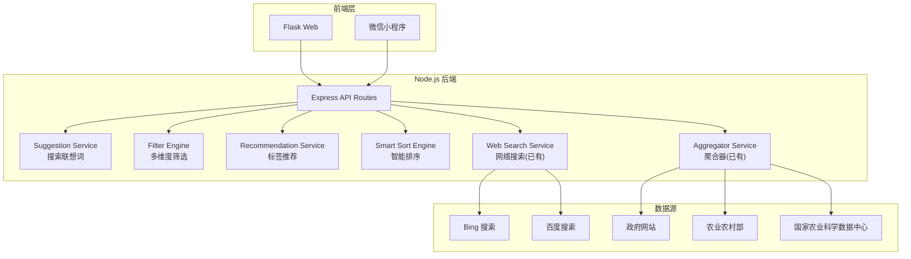

# Design Document: Enhanced Agricultural Search (农智汇增强搜索)

## Overview

本设计在现有农智汇平台基础上增强搜索能力，新增四大模块：搜索联想词服务、多维度筛选引擎、标签推荐服务、智能排序引擎。技术栈沿用现有 Node.js (Express) 后端 + Flask Web 前端 + 微信小程序架构，不引入额外数据库依赖。

## Architecture



## Components and Interfaces

### 1. Suggestion Service (搜索联想词服务)

新增文件: `server/services/suggestion.js`

```javascript
class SuggestionService {
  // 农业关键词字典 (内存 Trie 树)
  constructor()

  // 加载关键词字典
  loadDictionary(): void

  // 根据前缀查询建议 (支持中文和拼音)
  getSuggestions(prefix: string, limit?: number): string[]

  // 拼音前缀匹配
  pinyinMatch(prefix: string, keyword: string): boolean
}
```

### 2. Filter Engine (多维度筛选引擎)

新增文件: `server/services/filter.js`

```javascript
class FilterEngine {
  // 对资源列表应用筛选条件
  applyFilters(resources: Resource[], filters: FilterCriteria): Resource[]

  // 计算各筛选维度的计数
  computeFilterCounts(resources: Resource[], activeFilters: FilterCriteria): FilterCounts

  // 筛选条件类型
  // FilterCriteria: { year?: [number, number], category?: string[], source?: string[], region?: string[], cropType?: string[] }
}
```

### 3. Recommendation Service (标签推荐服务)

新增文件: `server/services/recommendation.js`

```javascript
class RecommendationService {
  // 获取相关推荐资源
  getRecommendations(resource: Resource, allResources: Resource[], limit?: number): Resource[]

  // 计算两个资源的相关度分数
  computeRelevanceScore(resourceA: Resource, resourceB: Resource): number
}
```

### 4. Smart Sort Engine (智能排序引擎)

新增文件: `server/services/smart-sort.js`

```javascript
class SmartSortEngine {
  // 按指定模式排序
  sort(resources: Resource[], mode: string, keyword?: string): Resource[]

  // 计算综合相关性分数
  computeRelevanceScore(resource: Resource, keyword: string): number

  // 支持的排序模式: 'relevance' | 'time' | 'authority' | 'popularity'
}
```

### 5. API Routes (新增/修改)

修改文件: `server/routes/search.js`, `server/routes/resources.js`

```
GET /api/suggestions?prefix=xxx        → 搜索联想词
GET /api/search?keyword=xxx&filters=xxx&sortBy=xxx  → 增强搜索(含筛选和排序)
GET /api/resources/:id/related          → 增强相关推荐
```

## Data Models

### Resource (扩展现有模型)

```javascript
{
  _id: string,           // 唯一标识
  title: string,         // 标题
  summary: string,       // 摘要
  category: string,      // 分类: 'law' | 'policy' | 'tech' | 'culture' | 'paper'
  publishTime: string,   // 发布时间 (ISO date string)
  source: string,        // 来源名称
  sourceUrl: string,     // 原始链接
  tags: string[],        // 标签列表
  authority: string,     // 权威等级: 'official' | 'professional' | 'general'
  platform: string,      // 平台标识
  platformName: string,  // 平台名称
  region: string,        // 地区 (可选)
  cropType: string,      // 作物类型 (可选)
  viewCount: number,     // 浏览量
  collectCount: number   // 收藏量
}
```

### FilterCriteria

```javascript
{
  year: [number, number],    // 年份范围 [起始年, 结束年]
  category: string[],        // 分类列表
  source: string[],          // 来源平台列表
  region: string[],          // 地区列表
  cropType: string[]         // 作物类型列表
}
```

### FilterCounts

```javascript
{
  year: { [year: string]: number },
  category: { [cat: string]: number },
  source: { [src: string]: number },
  region: { [reg: string]: number },
  cropType: { [crop: string]: number }
}
```

### Suggestion Dictionary Entry

```javascript
{
  keyword: string,     // 中文关键词
  pinyin: string,      // 拼音 (全拼, 空格分隔)
  pinyinInitial: string, // 拼音首字母
  weight: number       // 权重 (用于排序)
}
```

## Correctness Properties

*A property is a characteristic or behavior that should hold true across all valid executions of a system — essentially, a formal statement about what the system should do. Properties serve as the bridge between human-readable specifications and machine-verifiable correctness guarantees.*

### Property 1: Suggestion count limit

*For any* query prefix (including empty string, single character, multi-character Chinese, and pinyin), the Suggestion_Service SHALL return at most 8 suggestions.

**Validates: Requirements 1.3**

### Property 2: Pinyin prefix matching correctness

*For any* keyword in the agricultural dictionary that has a known pinyin representation, searching by any valid prefix of that pinyin SHALL include that keyword in the results (if within the limit).

**Validates: Requirements 1.5**

### Property 3: Filter correctness — all results match all active filters

*For any* list of resources and any combination of filter criteria, every resource in the filtered result SHALL satisfy ALL active filter conditions simultaneously.

**Validates: Requirements 2.2**

### Property 4: Filter removal round-trip

*For any* list of resources, applying a filter and then removing it SHALL produce the same result set as never having applied that filter.

**Validates: Requirements 2.3**

### Property 5: Filter count accuracy

*For any* list of resources and any set of active filters, the reported count for each filter option SHALL equal the actual number of resources that would match if that option were additionally selected.

**Validates: Requirements 2.4**

### Property 6: Recommendation invariants

*For any* resource and any pool of candidate resources, the recommendation list SHALL: (a) contain at most 6 items, (b) never include the source resource itself, and (c) be sorted by relevance score in descending order.

**Validates: Requirements 3.1, 3.4, 3.5**

### Property 7: Recommendation fallback to category

*For any* resource that has fewer than 3 tag-matched recommendations, the Recommendation_Service SHALL supplement with same-category resources until the list reaches min(6, available) items.

**Validates: Requirements 3.3**

### Property 8: Merge deduplication and labeling

*For any* set of search results merged from multiple sources, the merged list SHALL contain no two items with the same normalized title, and every item SHALL have a non-empty platform label.

**Validates: Requirements 4.4**

### Property 9: Authority sort ordering

*For any* list of resources sorted by authority mode, the authority levels SHALL appear in non-increasing order: official ≥ professional ≥ general.

**Validates: Requirements 5.3**

### Property 10: Relevance score composite formula

*For any* two resources where resource A has a strictly higher composite relevance score than resource B, resource A SHALL appear before resource B when sorted by relevance mode.

**Validates: Requirements 5.2**

### Property 11: Resource serialization round-trip

*For any* valid Resource object, serializing to JSON and then deserializing back SHALL produce an object equivalent to the original.

**Validates: Requirements 6.3**

## Error Handling

| Scenario | Handling |
|---|---|
| Suggestion dictionary load failure | Log error, return empty suggestions, retry on next request |
| External data source timeout (>10s) | Return results from other sources, log failure with source name |
| Invalid filter criteria | Ignore invalid filters, apply only valid ones |
| Empty search results after filtering | Return empty list with message suggesting filter removal |
| Recommendation pool empty | Return empty recommendation list |
| JSON serialization failure | Log error, skip malformed resource, continue with valid ones |

## Testing Strategy

### Property-Based Testing

Library: **fast-check** (JavaScript property-based testing library)

Each correctness property will be implemented as a property-based test with minimum 100 iterations. Tests will be tagged with the format:

```
Feature: enhanced-agri-search, Property N: [property description]
```

Property tests will validate:
- Suggestion service constraints (Properties 1-2)
- Filter engine correctness (Properties 3-5)
- Recommendation service invariants (Properties 6-7)
- Search merge behavior (Property 8)
- Sort ordering (Properties 9-10)
- Serialization round-trip (Property 11)

### Unit Tests

Unit tests will cover:
- Specific suggestion examples (e.g., "水稻" → expected suggestions)
- Filter edge cases (empty resource list, all filters active, no matching results)
- Recommendation with zero tags, single tag, many shared tags
- Sort mode switching
- Data source adapter error handling

### Test Configuration

```json
{
  "testFramework": "jest",
  "pbtLibrary": "fast-check",
  "pbtIterations": 100,
  "testDirectory": "server/__tests__"
}
```
